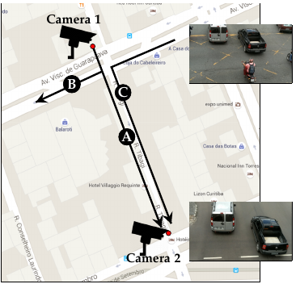
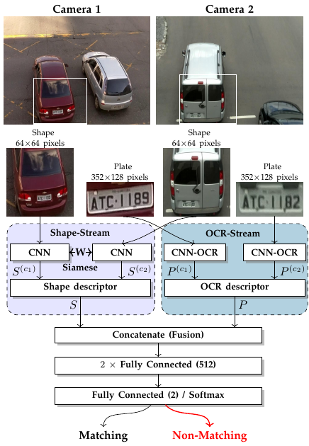
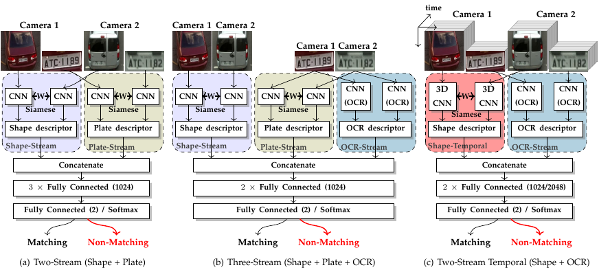

# Demo code for journal "Vehicle Re-identification: exploring feature fusion using multi-stream convolutional networks".

<!-- If you find this code useful in your research, please consider citing:

    @article{icaroICIP2019,
        title={A Two-Stream Siamese Neural Network for Vehicle Re-Identification by Using Non-Overlapping Cameras},
        author={de Oliveira, Icaro O and Fonseca, Keiko VO and Minetto, Rodrigo},
        journal={IEEE International Conference on Image Processing (ICIP)},
        year={2019}
    } -->

## Download
- [dataset](http://www.inf.ufpr.br/vri/databases/vehicle-reid/data.tgz)
- [videos](http://www.inf.ufpr.br/vri/databases/vehicle-reid/videos.tgz)
- [models](http://www.inf.ufpr.br/vri/databases/vehicle-reid/models.tgz)

## Authors

- Ícaro Oliveira de Oliveira (UTFPR) [mailto](mailto:icarofua@gmail.com)
- Rayson Laroca (UFPR) [mailto](mailto:raysonlaroca@gmail.com)
- David Menotti (UFPR) [mailto](mailto:menottid@gmail.com)
- Keiko Veronica Ono Fonseca (UTFPR) [mailto](mailto:keikoveronicaono@gmail.com)
- Rodrigo Minetto (UTFPR) [mailto](mailto:rodrigo.minetto@gmail.com)

This work addresses the problem of vehicle re-identification through a network of non-overlapping cameras. 

As our main contribution, we propose a novel two-stream convolutional neural network (CNN) that simultaneously uses two of the most distinctive and persistent features available: the vehicle appearance and its license plate. This is an attempt to tackle a major problem, false alarms caused by vehicles with similar design or by very close license plate identifiers.
In the first network stream, shape similarities are identified by a Siamese CNN that uses a pair of low-resolution vehicle patches recorded by two different cameras. 

In the second stream, we use a CNN for optical character recognition (OCR) to extract textual information, confidence scores, and string similarities from a pair of high-resolution license plate patches. 

Then, features from both streams are merged by a sequence of fully connected layers for decision.  As part of this work, we created an important dataset for vehicle re-identification with more than three hours of videos spanning almost 3,000 vehicles. In our experiments, we achieved a precision, recall and F-score values of 99.6%, 99.2% and 99.4%, respectively.

As another contribution, we discuss and compare three alternative architectures that explore the same features but using additional streams and temporal information.

## 1. Installation of the packages
pip install keras tensorflow scikit-learn futures imgaug

## 2 Configuration
config.py

If you prefer to run the model in the second gpu you can use config_1.py instead of config.py in the python code.

You need to change the following line:
from config import *
to
from config_1 import *

## 3 Training the algorithms

### 3.1 siamese plate
python siamese_plate_stream.py train

### 3.2 siamese shape
You can train the siamese shape with the following algorithms: resnet50, resnet6, resnet8, mccnn, vgg16, googlenet, lenet5, matchnet or smallvgg.

Example: python siamese_shape_stream.py train smallvgg

### 3.3 siamese two stream (plate + shape)
python siamese_two_stream.py train

### 3.4 siamese three stream (plate + shape + ocr)
python siamese_three_stream.py train

### 3.5 siamese two stream (ocr + shape)
python siamese_two_stream_ocr.py train

### 3.6 siamese temporal stream with 2 images
python siamese_temporal2.py train

### 3.7 siamese temporal stream with 3 images
python siamese_temporal3.py train

## 4 Testing the algorithms

### 4.1 siamese plate
python siamese_plate_stream.py test test_plate.json

Example of test.json:
{
  "img1":path1,
  "img2":path2
}

### 4.2 siamese shape
You can test the siamese shape with the following algorithms: resnet50, resnet6, resnet8, mccnn, vgg16, googlenet, lenet5, matchnet or smallvgg.

Example: python siamese_shape_stream.py test smallvgg test_shape.json

Example of test.json:
{
  "img1":path1,
  "img2":path2
}

### 4.3 siamese two stream (plate + shape)
python siamese_two_stream.py test test_two.json

Example of test.json:
{
  "img1_shape":path1,
  "img2_shape":path2,
  "img1_plate":path3,
  "img2_plate":path4,
}

### 4.4 siamese three stream (plate + shape + ocr)
python siamese_three_stream.py test test_three.json

Example of test.json:
{
  "img1_shape":path1,
  "img2_shape":path2,
  "img1_plate":path3,
  "img2_plate":path4,
  "ocr1":aaa-1234,
  "ocr2":abc-1234,
  "probs1":[0.0,0.5,0.4,0.3,1.0,0.2,0.1],
  "probs2":[1.0,0.4,0.3,0.5,1.0,0.8,0.9]
}

### 4.5 siamese two stream (ocr + shape)
python siamese_two_stream_ocr.py test test_two_ocr.json

Example of test.json:
{
  "img1":path1,
  "img2":path2,
  "ocr1":aaa-1234,
  "ocr2":abc-1234,
  "probs1":[0.0,0.5,0.4,0.3,1.0,0.2,0.1],
  "probs2":[1.0,0.4,0.3,0.5,1.0,0.8,0.9]
}

### 4.6 siamese temporal stream with 2 images (ocr + shape)
python siamese_temporal2.py test test_temporal2.json

Example of test.json:
{
  "img1":[path1, path2],
  "img2":[path3, path4],
  "ocr1":[aaa-1234,abc-1234],
  "ocr2":[caa-1234,bbc-1234],
  "probs1":[[0.0,0.5,0.4,0.3,1.0,0.2,0.1], [1.0,0.4,0.3,0.5,1.0,0.8,0.9]],
  "probs2":[[0.0,0.5,0.4,0.3,1.0,0.2,0.1], [1.0,0.4,0.3,0.5,1.0,0.8,0.9]]
}

### 4.7 siamese temporal stream with 3 images (ocr + shape)
python siamese_temporal3.py test test_temporal3.json

Example of test.json:
{
  "img1":[path1, path2, path3],
  "img2":[path4, path5, path6],
  "ocr1":[aaa-1234,abc-1234,ddd-2222],
  "ocr2":[caa-1234,bbc-1234,ccc-4321],
  "probs1":[[0.0,0.5,0.4,0.3,1.0,0.2,0.1], [1.0,0.4,0.3,0.5,1.0,0.8,0.9],[1.0,0.4,0.3,0.5,1.0,0.8,0.9]],
  "probs2":[[0.0,0.5,0.4,0.3,1.0,0.2,0.1], [1.0,0.4,0.3,0.5,1.0,0.8,0.9],[1.0,0.4,0.3,0.5,1.0,0.8,0.9]]
}

## 5. Generating the Datasets
You can generate the datasets for 1 image or the temporal stream between 2 to 5 images.

Example: python generate_n_sets.py 1
or
python generate_n_sets.py 2
